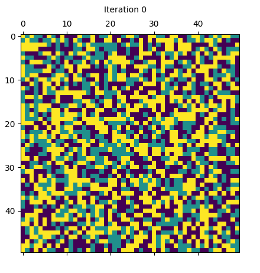
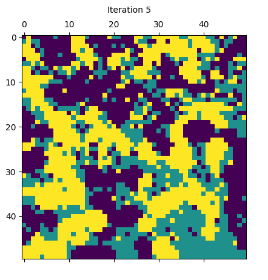
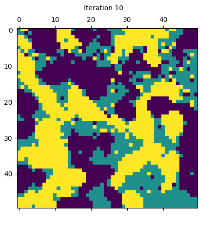
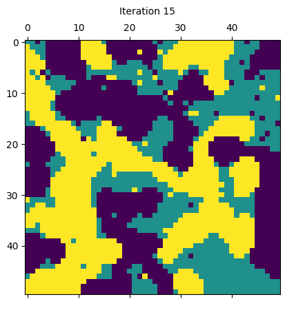

# Schelling Segregation Model

This repository contains a quick Python 3.x implementation of Schelling segregation population dynamics model, suggested by Schelling in his 1971 Journal of Mathematical Sociology article "Dynamic models of segregation".

The model is set in a N-by-N grid where agents belong to one of the two groups and can occupy a single 'cell' at a time step. Each iteration consists of agents checking if their neighborhood contains some fraction of neighbors that matches their group is greater than some given threshold. 

## Notes 

Some connections had been made with the Ising model dynamics. The ising model also relies on the similarities of the adjacent grid cells. These 'micro-state' dynamics can lead to some 'macro-state' behaviors where homophilic groups are clustered together with some density, which can be estimated by Monte Carlo method and calculating the entropy.

## How To Use
Install requirements.
```
pip install -r requirements.txt
```

Design your own config in `experiments.conf`.
```
# Inherit from `default` config
YOUR_CONFIG ${default} {
    neighbor_tol = 0.3          # Make desired changes.
}
```

Run with desired configuration from `experiments.conf`.
```
python schelling.py --config $YOUR_CONFIG
```

## Some Runs on Default Settings
<p align="center">
  
  
   
   
  
</p>

## Reference
The algorithm is abased on Schelling's original publication, given in `dynamic_models_of_segregation.pdf`. BibTex reference is provided below. I was inspired to research on the topic after visiting an exhibition on modern urban segregation at Chicago Cultural Center.
```
@article{schelling1971dynamic,
  title={Dynamic models of segregation},
  author={Schelling, Thomas C},
  journal={Journal of mathematical sociology},
  volume={1},
  number={2},
  pages={143--186},
  year={1971},
  publisher={Taylor \& Francis}
}
```